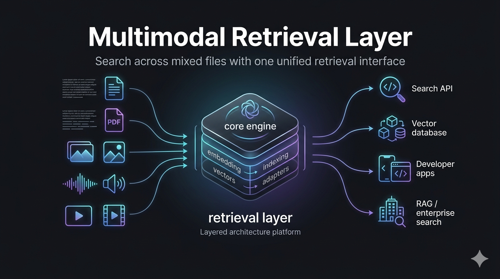

# OPEN RAG LAYER - MULTIMODAL RETRIEVAL LAYER



A provider-agnostic Python retrieval layer that wraps **Gemini Embedding 2** and **Qdrant** into a clean two-method API: `index()` and `search()`. Supports text, PDF, image, audio, and video out of the box.

## Install

```bash
# Clone and install (uv handles Python 3.12 automatically)
git clone https://github.com/your-org/open-rag-layer
cd open-rag-layer
uv sync
```

Or add to an existing project:

```bash
uv add git+https://github.com/your-org/open-rag-layer
# or, once published:
uv add open-rag-layer
```

## 30-Second Integration

```python
import asyncio
from rag_layer import RAGLayer

async def main():
    rag = RAGLayer()                          # defaults: Gemini + in-memory

    await rag.index("docs/report.pdf")        # index a file
    await rag.index("A note from Slack.", metadata={"source": "slack"})

    results = await rag.search("quarterly revenue")
    for r in results:
        print(f"[{r.score:.3f}] {r.chunk.content[:120]}")

asyncio.run(main())
```

Set `GOOGLE_API_KEY` and run — that's it.

---

## The Pipeline

Every call to `index()` passes through five stages:

```
┌─────────────────────────────────────────────────────────────────┐
│                        index(source)                            │
└───────────────────────────┬─────────────────────────────────────┘
                            │
              ┌─────────────▼──────────────┐
              │  1. DETECT                 │
              │  Auto-detect modality from │
              │  file extension or bytes   │
              │  (text/pdf/image/audio/    │
              │   video/URL)               │
              └─────────────┬──────────────┘
                            │
              ┌─────────────▼──────────────┐
              │  2. EXTRACT                │
              │  Modality-specific parser  │
              │  • text  → raw string      │
              │  • pdf   → text per page + │
              │            raw bytes       │
              │  • image → PIL.Image       │
              │  • audio → bytes (≤80 s)   │
              │  • video → bytes (≤120 s)  │
              └─────────────┬──────────────┘
                            │
              ┌─────────────▼──────────────┐
              │  3. CHUNK                  │
              │  Sliding window (512 chars │
              │  / 64 overlap) with        │
              │  sentence-boundary snap.   │
              │  Non-text passes through.  │
              └─────────────┬──────────────┘
                            │
              ┌─────────────▼──────────────┐
              │  4. EMBED                  │
              │  Gemini Embedding 2        │
              │  (gemini-embedding-2-      │
              │   preview, 3072-dim)       │
              │  Batched up to 100/call.   │
              └─────────────┬──────────────┘
                            │
              ┌─────────────▼──────────────┐
              │  5. UPSERT                 │
              │  Store vectors + payload   │
              │  → Qdrant  (production)    │
              │  → numpy   (dev/test)      │
              └────────────────────────────┘
```

Every call to `search()` runs:

```
query string / image bytes
        │
        ▼
  Embed query          ← RETRIEVAL_QUERY task_type
        │
  ┌─────┴──────────────────────────────┐
  │  search_mode                       │
  ├─ semantic  ANN vector search       │
  ├─ keyword   BM25 over chunk text    │
  └─ hybrid    both, fused via RRF ────┘
        │
  Metadata filter (optional)
        │
  Reranker (optional, cross-encoder)
        │
  List[SearchResult]  ← ranked, scored
```

---

## Integration Guide

### Option A — Zero infra (dev / notebooks)

No Qdrant, no API key. Uses random embeddings and an in-memory numpy index.
Great for unit tests and local prototyping.

```python
from rag_layer import RAGLayer

rag = RAGLayer(config={"embedder": "mock", "index": "memory"})
```

### Option B — Gemini + in-memory (staging / small corpora)

Real embeddings, no vector DB. Corpus lives in RAM and is rebuilt on restart.

```python
import os
from rag_layer import RAGLayer

os.environ["GOOGLE_API_KEY"] = "..."        # or set in shell

rag = RAGLayer(config={"embedder": "gemini", "index": "memory"})
```

### Option C — Gemini + Qdrant (production)

```bash
docker run -p 6333:6333 qdrant/qdrant
```

```python
from rag_layer import RAGLayer

rag = RAGLayer(config={"embedder": "gemini", "index": "qdrant"})
```

Qdrant defaults to `http://localhost:6333`, collection `rag_layer`. Override:

```python
from rag_layer.config import RAGConfig, QdrantIndexConfig

rag = RAGLayer(config=RAGConfig(
    embedder="gemini",
    index="qdrant",
    qdrant=QdrantIndexConfig(
        url="https://my-cluster.qdrant.io",
        api_key="qdrant-api-key",
        collection_name="my_docs",
    ),
))
```

---

## Indexing

### Files (auto-detected modality)

```python
await rag.index("notes.txt")
await rag.index("report.pdf")
await rag.index("diagram.png")
await rag.index("meeting.mp3")
await rag.index("demo.mp4")
```

### Batch

```python
await rag.index(["doc1.pdf", "doc2.pdf", "slide.png"])
```

### URLs

```python
await rag.index("https://example.com/article")
```

### Raw text

```python
await rag.index("The Q3 results exceeded expectations.", metadata={"source": "slack"})
```

### With metadata (filterable)

```python
await rag.index("report.pdf", metadata={"department": "finance", "year": 2024})
```

---

## Searching

### Plain text (semantic, default)

```python
results = await rag.search("quarterly revenue trends")
```

### Keyword (BM25)

```python
results = await rag.search("machine learning", search_mode="keyword")
```

### Hybrid (semantic + BM25, fused with RRF)

```python
results = await rag.search("earnings forecast", search_mode="hybrid")
```

### With filters

```python
results = await rag.search(
    "budget overview",
    filters={"department": "finance"},
)
```

### Full control via SearchQuery

```python
from rag_layer import SearchQuery

results = await rag.search(SearchQuery(
    text="AI product roadmap",
    search_mode="hybrid",
    limit=5,
    min_score=0.3,
    filters={"year": 2024},
    use_reranking=True,      # requires sentence-transformers
))
```

### Reading results

```python
for r in results:
    print(f"rank={r.rank}  score={r.score:.3f}")
    print(f"source={r.document.source}  page={r.chunk.metadata.page_number}")
    print(r.chunk.content[:200])
    print()
```

---

## Full Configuration Reference

```python
from rag_layer.config import (
    RAGConfig,
    GeminiEmbedderConfig,
    QdrantIndexConfig,
    ChunkingConfig,
)

config = RAGConfig(
    embedder="gemini",           # "gemini" | "mock"
    index="qdrant",              # "qdrant" | "memory"

    gemini=GeminiEmbedderConfig(
        api_key="...",           # default: $GOOGLE_API_KEY
        model="gemini-embedding-2-preview",
        output_dimensionality=3072,  # 768 | 1536 | 3072
        batch_size=100,
    ),

    qdrant=QdrantIndexConfig(
        url="http://localhost:6333",
        api_key=None,
        collection_name="rag_layer",
        prefer_grpc=False,
    ),

    chunking=ChunkingConfig(
        chunk_size=512,          # characters
        chunk_overlap=64,
        sentence_boundary=True,  # snap splits to sentence ends
    ),
)
```

---

## Integrating into a FastAPI app

```python
from contextlib import asynccontextmanager
from fastapi import FastAPI
from rag_layer import RAGLayer, SearchQuery

rag: RAGLayer

@asynccontextmanager
async def lifespan(app: FastAPI):
    global rag
    rag = RAGLayer(config={"embedder": "gemini", "index": "qdrant"})
    yield

app = FastAPI(lifespan=lifespan)

@app.post("/index")
async def index(path: str):
    docs = await rag.index(path)
    return {"indexed": len(docs)}

@app.get("/search")
async def search(q: str, mode: str = "hybrid"):
    results = await rag.search(q, search_mode=mode, limit=5)
    return [
        {"score": r.score, "content": r.chunk.content, "source": r.document.source}
        for r in results
    ]
```

---

## Project Layout

```
rag_layer/
├── __init__.py         # RAGLayer + public exports
├── schema.py           # Document, Chunk, SearchResult, SearchQuery, IndexInput
├── config.py           # RAGConfig, GeminiEmbedderConfig, QdrantIndexConfig, ChunkingConfig
├── ingestion/
│   └── ingestor.py     # detect → extract → chunk → embed → upsert
├── extractors/
│   ├── base.py         # Extractor protocol
│   ├── text.py         # .txt / .md / .html
│   ├── pdf.py          # .pdf  (pypdf, per page)
│   ├── image.py        # .png / .jpg / .webp
│   ├── audio.py        # .mp3 / .wav  (≤80 s chunks)
│   └── video.py        # .mp4 / .mpeg (≤120 s chunks)
├── chunking/
│   └── text_chunker.py # sliding window + sentence-boundary snap
├── embeddings/
│   ├── gemini.py       # Gemini Embedding 2 (google-genai)
│   └── mock.py         # random unit vectors (tests)
├── indexes/
│   ├── memory.py       # numpy cosine similarity
│   └── qdrant.py       # AsyncQdrantClient
├── retrieval/
│   └── engine.py       # semantic / keyword / hybrid / reranked
└── observability/
    └── logger.py       # loguru + @timed decorator
```

---

## Running Tests

```bash
uv run pytest tests/ -v          # 34 tests, no API keys needed
```

Tests use `MockEmbedder` (random unit vectors) + `InMemoryIndex` — no Gemini API key or Qdrant instance required.
